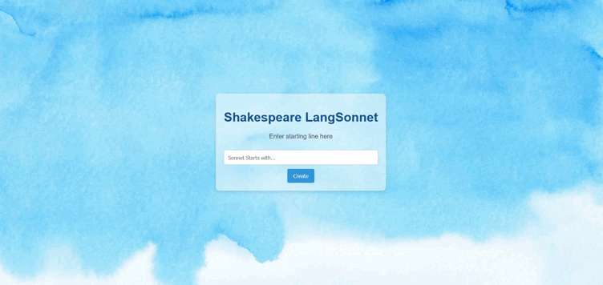

# <center> Shakespeare LangSonnet </center>

<p align="center"> 


</p> 

<p align="center">
  <a href="notebook/Model Training.ipynb">Notebook</a> •
  <a href="models/tokenizer.pickle">Tokenizer</a> •
  <a href="models/model_sp.h5">Model</a> 
</p>  


<details>
  <summary>Table of Contents</summary>
  <ol>
    <li>
      <a href="#about-the-project">About The Project</a>
    </li>
    <li>
      <a href="#built-with">Requirements</a>
    </li>
    <li><a href="#model-overview">Model Overview</a></li>
    <li><a href="#project-setup">Project Setup</a> </li>
  </ol>
</details>

## About The Project
ShakeLang is **LSTM** based language model trained on **William Shakespeare's Sonnet**. This project require some initial input for proceeding to create poem like Shakespeare.<br>
Create Sonnet's like Shakespeare

## Built With
   


## Model Overview
+ Deep Learning Model: LSTM  (350 Node)
+ Optimizer: Adam  
+ Loss: Categorical Crossentropy 
+ Metrice: Accuracy  
+ Trainable params: 2535151 (9.67 MB)
+ Training Epochs: 50


## Project Setup

+ Create and activate the virtual environment
```bash
python -m venv env
```

```bash
source env/Scripts/Activate
```

+ Install Dependencies
```bash
pip install -r requirements.txt
```
+ Running Server
```bash
python manange.py runserver
```
+ Open in Browser
```bash
http://127.0.0.1:8000/
```